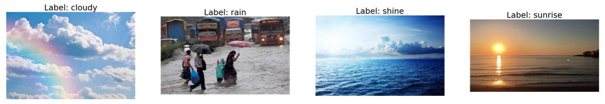

# Multi-Class-weather-dataset-for-Classification-task-using-general-VGG-and-customize-VGG-model-keras
Multi-Class weather dataset for Classification task using general VGG and customize VGG model keras

## Dataset:
We are using Multi-Class weather dataset for Classification task, it has four classes of images Cloudy, Rain, shine, and Sunrise. We have chosen this dataset because of uniqueness and not much work has been done on this dataset. We are using 901 images for training and 224 images for testing the model. The split is performed based on 20% testing and 80% training dataset by choosing the random images. As dataset is small only 1122 total examples that why we only choose 20% random images from each class. We are also resizing the image to 128x128x3 for training purpose. 

Class|	No. of Train Images|	No. of Test Images
--- | --- | ---
cloudy|	240|	60
rain|	172	|43
shine|	203	|50
sunrise|	286|	71

 

## Proposed CNN architecture for Image classification:
We have chosen VGG16 cnn model for Image classification the reason of choosing VGG16 is because its architecture robustness to captures a lot of details and outperform from basic alexnet and googlenet. There are some drawbacks in vgg model that cause problem like memory issue and overfitting that are solved in the next section by customizing the vgg network.
### Baseline VGG16:
General VGG model has 3x3 small size kernel based convolution layers followed by 2x2 max pooling that help it to decrease the width and height. The continuous increase in channel number throughout the convolution layers, making the model to getting deeper and capture more data. There are 13 conv layers followed by 3 dense layers in model and last 3 dense layers with 4096, 4096, number of classes neurons. The relu activation function is used in convolutions layers and next two dense layers, and softmax activation function is used in last layer.
### Customize VGG16:
we have decreased the number of convolutions layers to 10 and half the convolution layers channels comparison to the original vgg16. The neurons of last dense layers are also decreased to half now layers have 2048 neurons. The relu activation function is used in convolutions layers and next two dense layers, and softmax activation function is used in last layer. We have also introduced the layer of Batch Normalization and dropout to overcome overfitting problem of general vgg16 model.
### Assumptions/intuitions:
The increasing layers with quite many channels cause Baseline vgg16 to have large number of trainable parameters that not only cause memory issue but also required more training time.  Customize VGG16 help us to decrease the trainable parameters and the training time of model by also solving overfitting problem. Deeper model also required a lot of data to learns well, that’s why VGG16 would be good choice for small Multi-Class weather dataset.  The comparison of architecture of General VGG16 model and Upgraded VGG16 model shown below in the fig. 1. 

### Models summary:

Details |Baseline VGG16 |	VGG16 Customized
--- | --- | ---
Total params|	65,070,916|	3,629,908
Trainable params|	65,070,916|	3,629,908
Non-trainable params|	0	|0
One Epoch time|	49s 109ms|	10s 24ms
Training Accuracy|	0.9488|	0.8854
Test Accuracy|	0.8482|	0.8661
Weight Size|	508,457 KB|	28,435 KB

It clearly shows that our upgraded model not only have a smaller number of parameters and inference time but also good test accuracy because of avoiding overfitting. Overfitting can be observed as Baseline VGG16 training and testing accuracy have difference, so it shows that model is more overfit on training data and not performing good when testing on new data. Where in the VGG16 customize model there is less difference between training and test accuracy. One more thing that could be observable is model weight file size, it clearly shows that customize model is more easily deployable for product.
### Experimental Results: 
#### i.	Image classification 
There are 901 images for training and 224 images for testing the model performance. More ever all the images are rescaled and resized into 128*128 size. The categorical_crossentropy loss used in compilation and SGD used as optimizer. The batch size is set to 2 images and initial learning rate is set on 0.001 that decreased using callback function during continuous training.

##### a.	Performance on baseline/standard architecture:
The baseline VGG16 training data accuracy is 0.9488 and training loss is 0.1398 and validation/testing data accuracy is 0.8482. The confusion function of Baseline VGG16 shown below which illustrates that out of 224 images 190 correctly classified and 34 were incorrectly classified.
 

These are some wrong classified images by Baseline model. 

#### b.	Performance on Customized Architecture:
The Customized VGG16 training data accuracy is 0.8854 and training loss is 0.2900 and validation/testing data accuracy is 0. 8660. The confusion function of Baseline VGG16 shown below which illustrates that out of 224 images 30 correctly classified and 194 were incorrectly classified. 
These are some wrong classified images by Customized VGG16 model.

